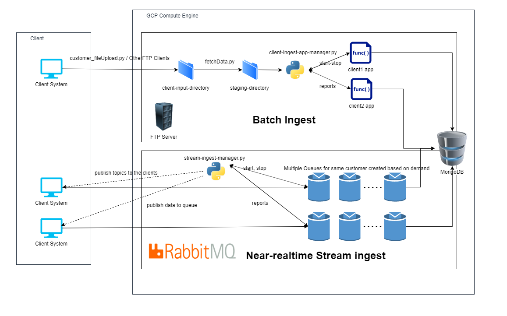

# Design Report

### Complete design

### Part 1 - Ingestion with batch (weighted factor for grades = 2)

##### 1. Define a set of constraints for files which should (or should not) be ingested and for the customer service profile w.r.t. ingestion constraints (e.g., number of files and data sizes).
The constraints set for the customers are that the maximum file size should not exceed 1MB for customer1. Also customer1 can upload only csv files. For customer2 the filesize should not exceed 2MB and customer2 uses only json data files. The restriction on the file size is a soft one. Typically its advised that the file size does not exceed the size, but if it exceeds we use microbatching on the server size to handle the large files. Before moving to the staging directory `fetchdata.py` checks the constraints and handles the microbatching if required. The restriction for the file type is placed according to the nature of the data. Customer1 uses the googleplaystore data and customer2 uses reviews data. The customer1 data does not have any sparse values and there are a lot of features. But customer2 data has lot of empty data and the format of the data varies.

##### 2. Each customer will put files to be ingested into a directory, client-input-directory.Implement a component mysimbdp-fetchdata that automatically detect which files should be ingested based on customer profiles and only move the files from client-input-directory inside mysimbdp. (1 point)
this is implemented in `code/fetchdata.py`. This file also handles the microbatching if required. Fetchdata uses the package watchdog to observe changes on the `client-input-directory` and notifies the python code with a callback if the contents of directory are changed.

##### 3. Each customer provides a simple program, clientbatchingestapp, which will take the customer's files as input and ingest the files into the final sink mysimbdp-coredms. Design and develop a component mysimbdp-batchingestmanager that invokes customer's clientbatchingestapp to perform the ingestion when files are moved into mysimbdp. mysimbdp imposes the model that clientbatchingestapp (and the customer) has to follow. (1 point)
This is implemented in `batch-manager.py` This file accumulates statistics from the mongodb and updates it to the mongodb - reports table. It also triggers the client app by creating a new process. The **important part about the implementation is that it is independent of the system that the client has for ingestion. It can be in python, java or simply a binary file and the manager can handle it easily**

##### 4. Develop test programs (clientbatchingestapp), test data, and test profiles for customers. Show the performance of ingestion tests, including failures and exceptions, for at least 2 different customers in your test environment. (1 point) & 5. Implement and provide logging features for capturing successful/failed ingestion as well as metrics about ingestion time, data size, etc., for files which have been ingested into mysimbdp. The log should be outputed in a separate file or database for analytics of ingestion. (1 point)
The reports are logged to mongodb in a different table named "reports" and all the files log all the important events to their own log files. Samples of these log files are provided in the `code` directory. Also the reports are seperated for each client and for each type of ingestion. We have an 100% success rate with FTP, because as the client uploads a file as long it passes the constraints and the server is up it always pushes it to the database.

### Part 2 - Near-realtime ingestion (weighted factor for grades = 2)

##### 1. For near-realtime ingestion, you introduce a simple message structure ingestmessagestructure that all consumers have to use. Design and implement ingestmessagestructure for your customers; explain your design. (1 point)
I have chosen a different ingestmessagestructure for each customer, because the nature of the data is different. Customer1's data is very dense data and all the fields are always full and customer2's data is more sparse and it makes sense to separate the message structure for the two customers. Customoer1 uses a simple comma seperated values to send his data, but customer2 uses key value pairs to send through his data.

##### 2. Customers will put their data into messages following ingestmessagestructure to send the data to a message broker, mysimbdp-databroker (provisioned by mysimbdp) and customers will write a program, clientstreamingestapp, which read data from the broker and ingest data into mysimbdp. Provide a component mysimbdp-streamingestmanager, which invokes on-demand clientstreamingestapp (e.g., start, stop). mysimbdp imposes the model that clientstreamingestapp has to follow. (1 point)
The python script `code/streamingestmanager.py` dynamically creates parallel topics for each client according to the load and also publishes the topics to the customer through RabbitMQ. It also has the ability to stop the open topics if the load is too low. The streamingestmanager also helps customers to know what topics are currently active and open to receive data. It helps the customer be in sync with the whole system. However because of the dynamic nature of the topics it is hard to ensure 100 percent data security because in a unlucky case, there is a slight possibility that the topic that the customer is trying to access has been closed and some data points may be lost. But the probability that this will happen is very low.

##### 3. Develop test programs (clientstreamingestapp), test data, and test profiles for customers. Show the performance of ingestion tests, including failures and exceptions, for at least 2 different customers in your test environment. (1 point)
The component is developed in `code/clientstreamingestapp.py`. This is an example application but the customer again has the option to access the message broker through any language or means. However it has to be capable of subscribing to the right topic as prvided by the manager. Currently it is dependent on sys args to achieve this. The code provided by the client should be able to read the topic name from the command line argument.

##### 4. clientstreamingestapp decides to report the its processing rate, including average ingestion time, total ingestion data size, and number of messages to mysimbdpstreamingestmanager within a pre-defined period of time. Design the report format and the communication mechanism for reporting. (1 point)
I'm using rabbitmq to pass reports from one process to another. Using this enables me to not worry about IPC. Since rabbitmq is already setup on the server, I'm using it for local communication also. This also enables me to relax the constraints for the clientapp, because now all the client has to do is to push the report about the performance to the `report` topic. THe manager app then pushes this to the mongodb. The response time is very fast when compared to a REST api daas system because it desnt wait for the tuple to be inserted to the db. It was able to push 65000 records in less than 30 seconds. But for all the data to be pushed into the db sometimmes it took more than 80secs for each row, for the worst case.

##### 5. Implement the feature to receive the report from clientstreamingestapp. Based on the report from clientstreamingestapp, when the performance is below a threshold, e.g., average ingestion time is too low, or too many messages have to be processed, mysimbdpstreamingestmanager decides to create more instances of clientstreamingestapp. Define a model for specifying constraints for creating/removing instances for each customer. (1 point).
This is already explained in the above sections. Based on the report received from the clientstreamingestapp, the manager app spawns new topics for the customers to accommodate more number of concurrent request. It also stops excess topics when the load is not high.

### Part 3 - Integration and Extension (weighted factor for grades = 1)

##### 1. Produce an integrated architecture for both batch and near-realtime ingestion features in this assignment and explain the architecture. (1 point)
The architecture that I have developed is already integrated to both types of ingestion . Both of the data ingestion have the same endpoint and it does not matter which type of ingestion the customer chooses to use. It all goes to the same table in the mongodb

##### 2. Assume that if a file for batch ingestion is too big to ingest using the batch ingestion implementation in Part 1, design your solution to solve this problem by reusing your batch or near-realtime components in Parts 1 or 2. (1 point)
I have implemented this for both parts.
For part 1 I have microbatching which helps to split a large file to smaller ones easily and then use these files to dataingest
For part 2 I am opening parallel topics for the customers to push data into. If the queues get full and takes a lot of time to process this is recognized and new topics are added to the available topics and customer can use this to push new data

##### 3. Regardless of programming languages used, explain why you as a platform provider should not see the code of the customer, like clientbatchingestapp and clientstreamingestapp. In which use cases, you can assume that you know the code? (1 point)
With all the privacy laws in the current world, it is not a good idea to see/use other people's code. It is usually a very important asset of the company and exposing this would not be in client's best interest. Platform provider should ensure high confidentiality to it customers  or it is likely that he will loose their customers.

##### 4. If you want to detect the quality of data and allow ingestion only for data with a pre-defined quality of data condition, how you, as a platform provider, and your customers can work together? (1 point)
Schema validation has to be added at the mongodb level and in the clientbathingestapp and clientstreamingestapp. This schema needs to be discussed with the client and has to be agreed upon by both the parties

##### 5. If a consumer has multiple clientbatchingestapp and clientstreamingestapp, each is suitable for a type of messages or files, how would you extend your design and implementation in Parts 1 & 2 (only explain the concept/design) to support this requirement. (1 point)
This is already implemented for two different customers, so this is not hard to extend for same customers different type of messages. I am already using multiple datatypes for the different customers.

# Bonus points
### If you can design and implement the dynamic management of instances for Part 2/Question 5, you get 5 points
Implemented in `code/fetchdata.py`
### If you can develop the solution that automatically switch from batch to microbatching based on a set of constraints (e.g., file size, time, bandwidth) you get 5 points
Implemented in `code/streamingestmanager.py`
